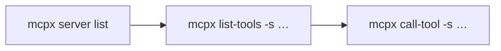

# mcpx

[](./package.json)
[](./package.json)

Agents often cannot reach MCP servers that the IDE has not allowlisted. They *can* run shell commands.

**mcpx** is a CLI on your `PATH` that connects to named, configured MCP Servers and exposes their Tools — so agents (and humans) use those servers without waiting on IDE settings.

It is **not** an MCP server, proxy, or gateway. It does **not** edit Cursor or IDE `mcp.json`.

## Install

From a clone of this repo (npm publish is not available yet):

```bash
npm install
npm run build
npm link          # puts `mcpx` on your PATH
mcpx --help
```

Or run without linking:

```bash
node dist/cli.js --help
```

Requires Node.js ≥ 20.

## Agent loop

Same three steps for agents and humans. Tool commands always need a Server name (`-s` / `--server`).



1. List Servers (and Purpose) — choose which Server to use
2. List Tools on that Server — names, descriptions, input schemas
3. Call a Tool on that Server — pass JSON args

```bash
mcpx server list
mcpx list-tools -s db
mcpx call-tool -s db --tool query --args '{"sql":"select 1"}'
```

Stdout is agent-first JSON by default. Success shapes, pretty/TTY rules, and v1 limits: [`docs/cli.md`](./docs/cli.md#output-and-exit-codes).

## Config

Default path: `~/.mcpx/mcp.json`

Override with `MCPX_CONFIG` (full path to an `mcp.json`) for tests or disposable environments. When set, `mcpx` reads that file and never touches the home Config.

```bash
MCPX_CONFIG=/tmp/demo-mcp.json mcpx server list
```

Top-level shape is an `mcpServers` map. The map key is the Server name. Optional `description` is the Server’s **Purpose** (shown by `server list`). If omitted, Purpose falls back to identifiable details (`name` + `command` or `url`). Exactly one transport per Server: stdio (`command`, optional `args` / `env`) **or** Streamable HTTP (`url`, optional `headers`) — not both, not neither. Legacy SSE is out of scope for v1.

```json
{
  "mcpServers": {
    "db": {
      "description": "Local database MCP",
      "command": "npx",
      "args": ["-y", "@example/db-mcp"],
      "env": { "DB_URL": "postgres://localhost/app" }
    },
    "intellij": {
      "description": "IntelliJ IDEA MCP",
      "url": "http://127.0.0.1:64342/mcp",
      "headers": { "Authorization": "Bearer …" }
    }
  }
}
```

Hand-editing `~/.mcpx/mcp.json` is valid. `mcpx` never edits Cursor/IDE `mcp.json`.

## Adding Servers

Prefer paste/merge from a JetBrains Copy HTTP Stream / Copy Stdio Config snippet:

```bash
mcpx server add --from-file snippet.json
mcpx server add --from-clipboard
```

Flag-based add also works:

```bash
mcpx server add --name db --description "Local database MCP" \
  --command npx --args '["-y","@example/db-mcp"]'
mcpx server add --name intellij --description "IntelliJ IDEA MCP" \
  --url http://127.0.0.1:64342/mcp
```

Snippet shapes, clipboard resolution, and duplicate-name rules: [`docs/cli.md`](./docs/cli.md#mcpx-server-add).

## Commands

```bash
mcpx server list
mcpx server add --name … --command … | --url …
mcpx server add --from-file <path>
mcpx server add --from-clipboard
mcpx server remove <name>
mcpx list-tools --server <name>
mcpx call-tool --server <name> --tool <tool> --args '<json>'
```

Full flag reference: [`docs/cli.md`](./docs/cli.md).

## Agent Guide

Redistributable instructions for shell-capable agents (Agent Guide + Cursor / `AGENTS.md` Adapters) live in [`agent-guide/`](./agent-guide/). Pack with `npm run pack:agent-guide` (zip on GitHub Releases for `v*` tags). Details: [`docs/adr/0001-agent-guide-pack.md`](./docs/adr/0001-agent-guide-pack.md).

## See also

- [`docs/cli.md`](./docs/cli.md) — Output shapes, v1 limits, full CLI reference
- [`agent-guide/`](./agent-guide/) — Agent Guide pack
- [`CONTEXT.md`](./CONTEXT.md) — Domain language
- [`INCEPTION.md`](./INCEPTION.md) — Problem, vision, scope
- [`FEATURES.md`](./FEATURES.md) — Shipped / next / won’t
- [`docs/adr/0001-agent-guide-pack.md`](./docs/adr/0001-agent-guide-pack.md) — Agent Guide pack ADR

## Development

```bash
npm run typecheck
npm test
```

Acceptance tests invoke the built `dist/cli.js` as a black box (exit code, stdout, stderr) with `MCPX_CONFIG` pointing at a temp file.

Stack: Node ≥20 · [commander](https://github.com/tj/commander.js) · [MCP SDK](https://www.npmjs.com/package/@modelcontextprotocol/sdk) · [Vitest](https://vitest.dev/)
